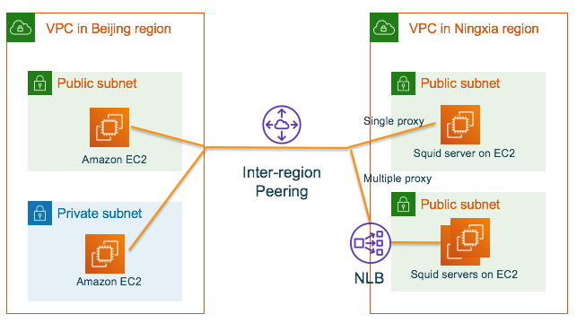

# accelerate-access-global

I choice open source squid as transparent proxy

# Simplest way - Only used as proxy
## CentOS / Amazon Linux
[Reference guide](https://elatov.github.io/2019/01/using-squid-to-proxy-ssl-sites/)

Red Hat Enterprise Linux / CentOS Squid does support –with-openssl 

1. Install
```bash
# create EC2 instance for Squid and SSH login to EC2
sudo yum info squid
sudo yum install -y squid

sudo mkdir -p /etc/squid/certs
openssl req -new -newkey rsa:2048 -sha256 -days 365 -nodes -x509 -extensions v3_ca -keyout squid-ca-key.pem -out squid-ca-cert.pem -subj "/C=CN/ST=PEK/L=squid/O=squid/CN=squid"
cat squid-ca-cert.pem squid-ca-key.pem >> squid-ca-cert-key.pem
sudo mv squid-ca-cert-key.pem /etc/squid/certs/.
sudo chown squid:squid -R /etc/squid/certs
```

2. Configure /etc/squid/squid.conf
- Basic configure for acl
- Enable TLS/SSL support
- Enable filtering for egress control (optional)
```
sudo grep -vE '^$|^#' /etc/squid/squid.conf
acl localnet src 10.0.0.0/8 # RFC1918 possible internal network
acl localnet src 172.16.0.0/12  # RFC1918 possible internal network
acl localnet src 192.168.0.0/16 # RFC1918 possible internal network
acl localnet src fc00::/7       # RFC 4193 local private network range
acl localnet src fe80::/10      # RFC 4291 link-local (directly plugged) machines
acl SSL_ports port 443
acl Safe_ports port 80      # http
acl Safe_ports port 21      # ftp
acl Safe_ports port 443     # https
acl Safe_ports port 70      # gopher
acl Safe_ports port 210     # wais
acl Safe_ports port 1025-65535  # unregistered ports
acl Safe_ports port 280     # http-mgmt
acl Safe_ports port 488     # gss-http
acl Safe_ports port 591     # filemaker
acl Safe_ports port 777     # multiling http
acl CONNECT method CONNECT
http_access deny !Safe_ports
http_access deny CONNECT !SSL_ports
http_access allow localhost manager
http_access deny manager
http_access allow localnet
http_access allow localhost
http_access deny all
http_port 3128
coredump_dir /var/spool/squid
refresh_pattern ^ftp:       1440    20% 10080
refresh_pattern ^gopher:    1440    0%  1440
refresh_pattern -i (/cgi-bin/|\?) 0 0%  0
refresh_pattern .       0   20% 4320

logfile_rotate 10
debug_options rotate=10

#Add below content
http_port 3128 ssl-bump \
  cert=/etc/squid/certs/squid-ca-cert-key.pem \
  generate-host-certificates=on dynamic_cert_mem_cache_size=16MB
https_port 3129 intercept ssl-bump \
  cert=/etc/squid/certs/squid-ca-cert-key.pem \
  generate-host-certificates=on dynamic_cert_mem_cache_size=16MB
sslcrtd_program /usr/lib64/squid/ssl_crtd -s /var/lib/ssl_db -M 16MB
acl step1 at_step SslBump1
ssl_bump peek step1
ssl_bump bump all
ssl_bump splice all
```

3. Check configure and start
```bash
sudo squid -k parse

#Start squid
sudo systemctl start squid
sudo systemctl enable squid
sudo systemctl status squid.service

# Stop squid
#sudo systemctl stop squid

# Create the SSL database and make sure the squid user can access it
sudo /usr/lib64/squid/ssl_crtd -c -s /var/lib/ssl_db
sudo chown squid:squid -R /var/lib/ssl_db
```

4. Add inbound port 3128/3129 to the instance security group

5. Monitor by access log
```bash
sudo tail -f /var/log/squid/access.log
```

## Ubuntu
[Ubuntu / Debian offical AMI，Squid does not support ssl](https://codepad.ly2314.cc/squid3-with-https_port-on-ubuntu-debian/) 

So Ubuntu / Debian need re-compile from source and add --enable-ssl --with-openssl during compiling.

# Testing:
## Same VPC
1. For curl and wget
```bash
# Login to the second EC2 within same VPC as Squid EC2
curl -I -x http://proxy_ip:proxy_port -L blog.hatena.ne.jp -k
curl https://www.bing.com/ -x http://proxy_ip:proxy_port -k -vvv > /dev/null
curl -O https://releases.hashicorp.com/terraform/0.11.10/terraform_0.11.10_linux_amd64.zip -x http://proxy_ip:proxy_port -k
wget -e "https_proxy = http://proxy_ip:proxy_port" https://github.com/Medium/phantomjs/releases/download/v2.1.1/phantomjs-2.1.1-linux-x86_64.tar.bz2 --no-check-certificate
wget -e "https_proxy = http://proxy_ip:proxy_port" https://binaries.sonarsource.com/Distribution/sonarqube/sonarqube-6.7.7.zip --no-check-certificate
```

2. For AWS cli
```bash
# AWS CLI https://docs.aws.amazon.com/cli/latest/userguide/cli-configure-proxy.html
export HTTP_PROXY=http://proxy_ip:proxy_port
export HTTPS_PROXY=http://proxy_ip:proxy_port
```

## Cross region
1. Enable Inter-region VPC peering
2. Support single server
3. Support multiple servers
4. The speed can reach MB/s



## Cross region testing
1. Client in public subnet
```bash
curl -O https://releases.hashicorp.com/terraform/0.11.10/terraform_0.11.10_linux_amd64.zip -x http://proxy_ip:proxy_port -k

# Output snippet
# X-Cache: MISS from {proxy_domain}
# X-Cache-Lookup: MISS from {proxy_domain}:{proxy_port}
# Via: 1.1 proxy_domain (squid/3.5.20)
# Connection: keep-alive
#  % Total    % Received % Xferd  Average Speed   Time    Time     Time  Current
#                                 Dload  Upload   Total   Spent    Left  Speed
# 100 19.9M  100 19.9M    0     0  3859k      0  0:00:05  0:00:05 --:--:-- 5021k


wget -e "https_proxy = http://proxy_ip:proxy_port" https://github.com/Medium/phantomjs/releases/download/v2.1.1/phantomjs-2.1.1-linux-x86_64.tar.bz2 --no-check-certificate

# Output snippet
# --2020-03-03 03:34:16--  https://github.com/Medium/phantomjs/releases/download/v2.1.1/phantomjs-2.1.1-linux-x86_64.tar.bz2
# Connecting to proxy_ip:proxy_port... connected.
# Proxy request sent, awaiting response... 302 Found
# Location: .........
# Connecting to proxy_ip:proxy_port... connected.
# Proxy request sent, awaiting response... 200 OK
# Length: 23415665 (22M) [application/octet-stream]
# Saving to: ‘phantomjs-2.1.1-linux-x86_64.tar.bz2’
# 
# 100%[==============================================================================================================================================>] 23,415,665  4.78MB/s   in 4.7s
# 2020-03-03 03:34:23 (4.78 MB/s) - ‘phantomjs-2.1.1-linux-x86_64.tar.bz2’ saved [23415665/23415665]
```

2. Client in private Subnet
```bash
wget -e "https_proxy = http://proxy_ip:proxy_port" https://github.com/Medium/phantomjs/releases/download/v2.1.1/phantomjs-2.1.1-linux-x86_64.tar.bz2 --no-check-certificate

# Output snippet
# --2020-03-03 03:42:00--  https://github.com/Medium/phantomjs/releases/download/v2.1.1/phantomjs-2.1.1-linux-x86_64.tar.bz2
# Connecting to roxy_ip:proxy_port... connected.
# Proxy request sent, awaiting response... 302 Found
# Location: ........
# Connecting to roxy_ip:proxy_port... connected.
# Proxy request sent, awaiting response... 200 OK
# Length: 23415665 (22M) [application/octet-stream]
# Saving to: ‘phantomjs-2.1.1-linux-x86_64.tar.bz2’
# 
# 100%[==============================================================================================================================================>] 23,415,665  5.14MB/s   in 5.7s
# 2020-03-03 03:42:08 (3.93 MB/s) - ‘phantomjs-2.1.1-linux-x86_64.tar.bz2’ saved [23415665/23415665]
```

